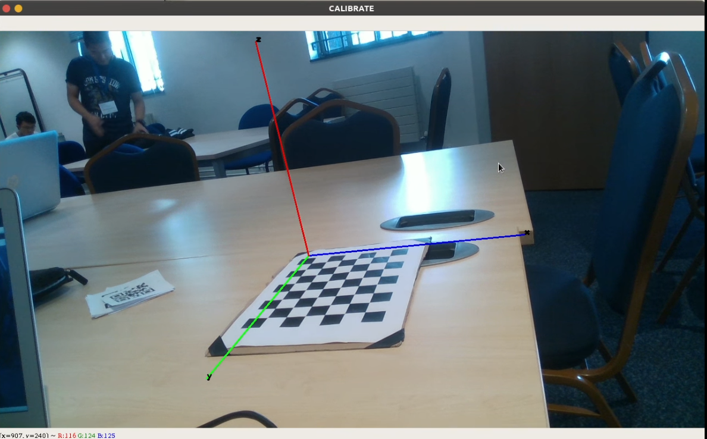
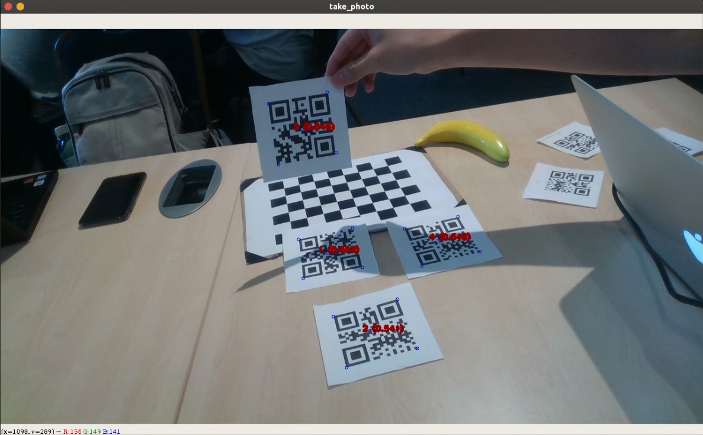
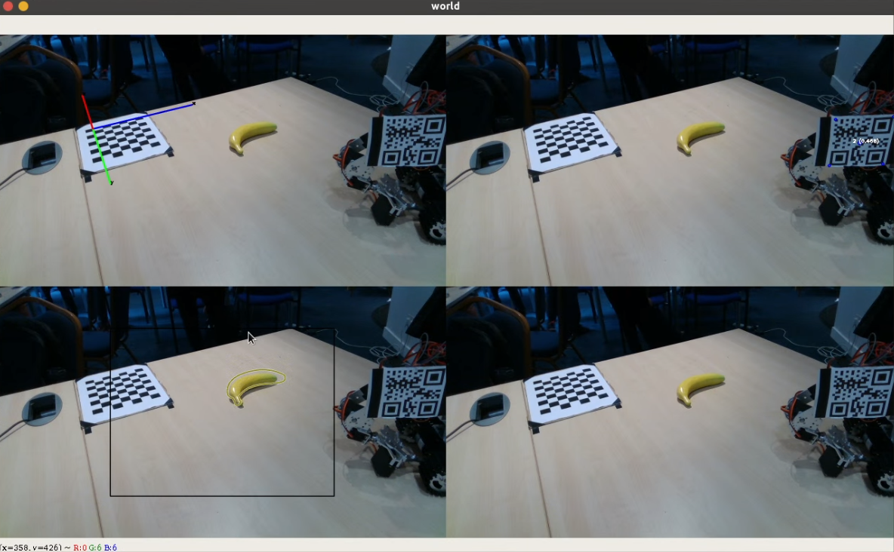

## LachFore

#### Introduction

This repo is about the project i did in 2019 summer robot and AI of imperial college London. I wrote it for realsense camera D415 in ubuntu18.04. By the time 2019-8-10,  Realsense camera python SDK only stably support Linux and Windows. So i think it may not work in Macos .

This code is wrote in python3.6

It mainly consist of three part.

1.  calibration part: using the [opencv](https://pypi.org/project/opencv-python/) `findChessboardCorners` function and depth information to fast calbrate camera.

2. QR-code tracking part: i use  [qrcode](https://pypi.org/project/qrcode/) to generate QR-code, and [pyzbar](https://pypi.org/project/pyzbar/) to recognize every frame, then use kalman filter to stabilize the tracking

2. NN model part: i use [Segmentation-driven 6D Object Pose Estimation(CVPR 2019)](https://github.com/cvlab-epfl/segmentation-driven-pose) to predict the pose of the objects in RGB image

#### Installation

1. create a python3.6 virtual environment with pip and enter it
2. enter the LachFore fold, type `pip install -r requirements.txt` 
3. install realsense [SDK](https://www.intelrealsense.com/developers/)  ,connect to the realsense camera, you can see if it is connected use `realsense-viewer`
4. `git clone https://github.com/cvlab-epfl/segmentation-driven-pose.git`, download pretrained weight following the instruction of the github repo.
5. `python main.py `  

#### Notes

1. most of the parameters are in `world.py`
2. you can change the  model easily, you should rewrite the class in `predict.py` , which should have `predict` method
3. i draw lessons from [realsense code examples](https://github.com/IntelRealSense/librealsense/tree/master/wrappers/python/examples/box_dimensioner_multicam) a lot, like the `realsense_device_manager.py` , but i change it for only one camera situation.

